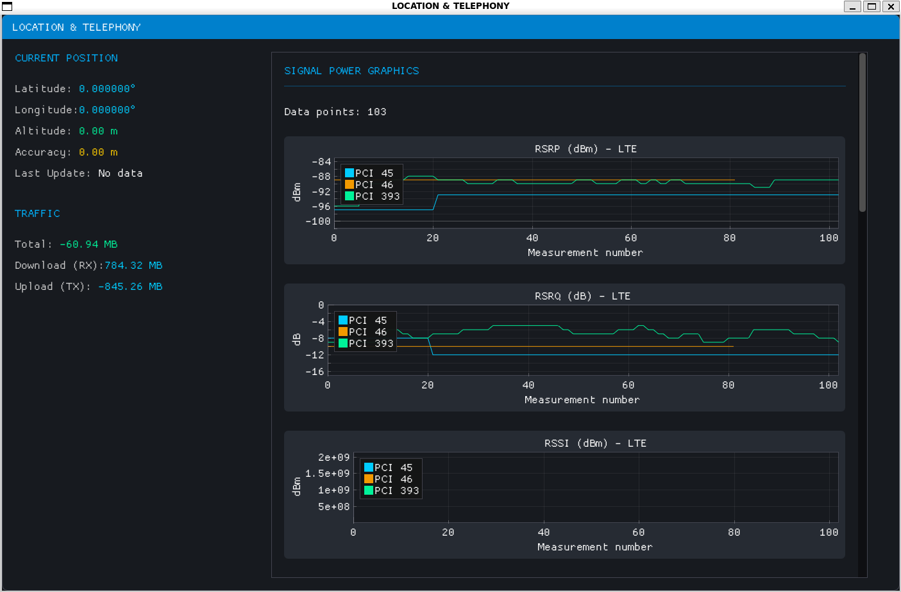
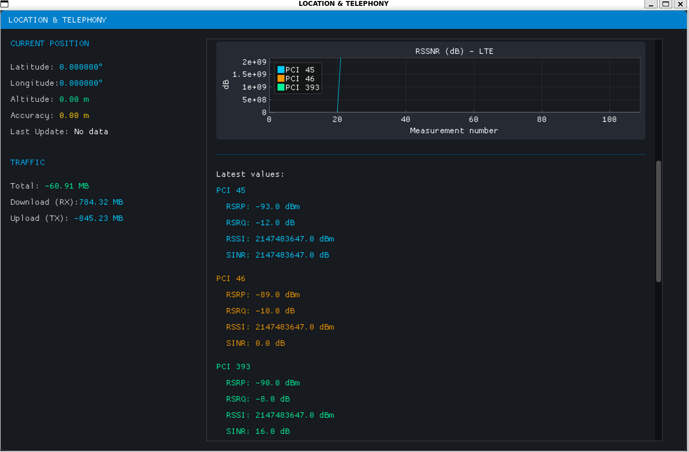

# Android_Development_backend
# Все лабораторные работы по порядковым номерам находятся в ветках, здесь только крайняя лаба...

## Практическая работа №13 "Работа с базой данных (PostgreSQL) из С++"

### Цель
1. Доработать код backend-сервера для взаимодействия с базой данных PostgreSQL.
    - Создать собственную базу данных;✅
    - Создать таблицу на основе данных, которые вы собираете с Android-приложения (Практика X).✅
    - При каждом получении данных с Android-приложения, добавить данные в таблицу.✅
2. В GUI-потоке приложения отображать только текущее значение (пока НЕ загружаем из базы данных);✅
3. Графики уровня сигнала (RSRP, RSSI, SINR) также отображаем, кладя значения в массив по мере поступления данных.
    - При получении данных о НЕСКОЛЬКИХ сотах, отображаем графики для каждого PCI. Например, пришли данные о двух сотах со значениями PCI_1 = 7 (RSRP = -100 [dBm]), PCI_2 = 13 (RSRP = -89 [dBm]), на графиках должно параллельно отобразиться 2 значения (разными цветами) по оси Y в одном значении оси `X`;✅
    - В легенде графика добавить значения для всех PCI.✅
4. Обновить Github-репозиторий. Обновить README.md, описать возможности вашего приложения.✅

### Возможности приложения
- Мониторинг местоположения (отображение GPS-координат, высоты и точности в реальном времени)
- Анализ сигнала сотовой сети (поддержка LTE, GSM, 5G/NR с метриками RSRP, RSRQ, RSSI, SINR)
- Графики сигнала (построение графиков для нескольких сот (PCI) одновременно)
- Сохранение в PostgreSQL (запись всех измерений в базу данных)
- Учёт трафика (отображение потреблённого трафика (RX/TX))

